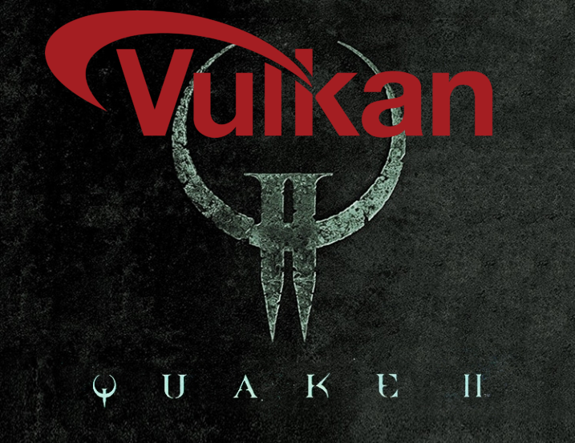

<p align="center"></p>

### Build status
[](https://ci.appveyor.com/project/kondrak/vkquake2)
[](https://travis-ci.org/kondrak/vkQuake2)
[](https://github.com/kondrak/vkQuake2/actions?query=workflow%3ACI)

Overview
===
This is the official Quake 2 code v3.21 with Vulkan support and mission packs included. The goal of this project is to maintain as much compatibility as possible with the original game - just pure, vanilla Quake 2 experience as we knew it back in 1997. There are, however, a few notable differences that made the cut for various reasons:

- world colors have been slightly upgraded - the game's original, darker look can be toggled with the `vk_postprocess` console command
- 64-bit support, additional screen resolutions and DPI awareness have been added
- underwater vision effect similar to software renderer has been implemented
- antialiasing and sample shading is now natively supported
- anisotropic filtering toggle has been added
- players can now change texture filtering modes from within the video menu
- mouse acceleration has been disabled
- console contents can be scrolled with a mouse wheel
- HUD elements, menus and console text are now scaled accordingly on higher screen resolutions (can be overridden with the `hudscale` console command)
- viewmodel weapons are no longer hidden when FOV > 90
- Vulkan renderer fixes broken warp texture effect (water, lava, slime) seen in OpenGL
- software renderer has been completely replaced with [KolorSoft 1.1](https://github.com/qbism/Quake2-colored-refsoft) - this adds colored lighting and fixes severe instabilities of the original implementation
- triangle fans have been replaced with indexed triangle lists due to Metal/MoltenVK limitations
- on Linux, sound is now handled by ALSA instead of OSS
- support for OGG/FLAC/MP3/WAV music has been added in addition to standard CD audio
- music volume slider has been added (OGG/FLAC/MP3/WAV only, CD music still plays at full volume as originally intended)
- game menus have been slightly improved
- added Nightmare/Hard+ skill to the game menu
- added the `aimfix` console command, backported from Berserker@Quake2

A more detailed description of the thought process behind this project can be found in my [blog post](https://kondrak.github.io/posts/2020-09-20-porting-quake2-to-vulkan/), where I explain the overall design, how I attacked some of the problems and also how things developed after the initial release.

Building
===
For extra challenge I decided to base vkQuake2 on the original id Software code. Because of this, there are no dependencies on external SDL-like libraries and the entire project is mostly self-contained. This also implies that some of the original bugs could be present.

## Windows
- download and install the latest [Vulkan SDK](https://vulkan.lunarg.com/)
- install [Visual Studio Community 2019](https://www.visualstudio.com/products/free-developer-offers-vs) with C++ MFC for build tools and Windows 10 SDK
- open `quake2.sln` and choose the target architecture (x86/x64) - it should build without any additional steps

## Linux
Unfortunately, Linux code for Quake 2 has not aged well and for that reason only the Vulkan renderer is available for use at this time. Build steps assume that Ubuntu is the target distribution:
- install required dependencies:
```
sudo apt install make gcc g++ mesa-common-dev libglu1-mesa-dev libxxf86dga-dev libxxf86vm-dev libasound2-dev libx11-dev libxcb1-dev
```
- Install the latest [Vulkan SDK](https://vulkan.lunarg.com/) - the easiest way is to use [LunarG Ubuntu Packages](https://vulkan.lunarg.com/sdk/home#linux) - just follow the instructions and there will be no additional steps required. If you decide for a manual installation, make sure that proper environment variables are set afterwards by adding the following section to your `.bashrc` file (replace SDK version and location with the ones corresponding to your system):
```
export VULKAN_SDK=/home/user/VulkanSDK/1.2.170.0/x86_64
export PATH=$VULKAN_SDK/bin:$PATH
export LD_LIBRARY_PATH=$VULKAN_SDK/lib:$LD_LIBRARY_PATH
export VK_LAYER_PATH=$VULKAN_SDK/etc/explicit_layer.d
```
- make sure your graphics drivers support Vulkan (run `vulkaninfo` to verify) - if not, you can get them with:
```
sudo apt install mesa-vulkan-drivers
```
- enter the `linux` directory and type `make release` or `make debug` depending on which variant you want to build - output binaries will be placed in `linux/releasex64` and `linux/debugx64` subdirectories respectively

## MacOS
- download and extract the latest [Vulkan SDK](https://vulkan.lunarg.com/)
- install XCode 10.1 (or later) and add the `VULKAN_SDK` environment variable to Locations/Custom Paths - make it point to the downloaded SDK
- open `macos/vkQuake2.xcworkspace` - it should build without any additional steps
- alternatively, you can compile the game from the command line - modify your `.bash_profile` and add the following entries (replace SDK version and location with the ones corresponding to your system):
```
export VULKAN_SDK=/home/user/VulkanSDK/1.2.170.0
export VK_ICD_FILENAMES=$VULKAN_SDK/macOS/share/vulkan/icd.d/MoltenVK_icd.json
export VK_LAYER_PATH=$VULKAN_SDK/macOS/share/vulkan/explicit_layer.d
```
- enter the `macos` directory and run `make release-xcode` or `make debug-xcode` depending on which variant you want to build - output binaries will be placed in `macos/vkQuake2` subdirectory
- it is also possible to build the game with Command Line Developer Tools if you have them installed: enter the `macos` directory and run `make release` or `make debug` - output binaries will be placed in `macos/release` and `macos/debug` subdirectories respectively

This project uses the Vulkan loader bundled with the SDK, rather than directly linking against `MoltenVK.framework`. This is done so that validation layers are available for debugging. Builds have been tested using MacOS 10.14.2.

## FreeBSD
- install required Vulkan packages:
```
pkg install vulkan-tools vulkan-validation-layers
```
- make sure your graphics drivers support Vulkan (run `vulkaninfo` to verify) - if not, you should either update them or find a package that is best suited for your hardware configuration
- enter the `linux` directory and type `make release` or `make debug` depending on which variant you want to build - output binaries will be placed in `linux/releasex64` and `linux/debugx64` subdirectories respectively

## Raspberry Pi 4
Thanks to the effort of [Igalia](https://www.igalia.com/) and their [V3DV Driver](https://blogs.igalia.com/itoral/2020/07/23/v3dv_vulkan_driver_update/), it is possible to compile and run vkQuake2 on Raspberry Pi 4. Same build instructions as for Linux apply.

Running
===
## Windows
The Visual Studio C++ Redistributable is required to run the application: [32-bit](https://aka.ms/vs/16/release/vc_redist.x86.exe) or [64-bit](https://aka.ms/vs/16/release/vc_redist.x64.exe) depending on the chosen architecture. These are provided automatically if you have Visual Studio installed.

## All platforms
The [release package](https://github.com/kondrak/vkQuake2/releases) comes only with the Quake 2 Demo content to showcase Vulkan functionality. For full experience, copy retail `.pak`, model and video files into the `baseq2` directory and run the executable. For mission packs, copy necessary data to `rogue` ("Ground Zero"), `xatrix` ("The Reckoning") and `zaero` ("Quake II: Zaero") directories respectively. You can then start the game with either `./quake2 +set game rogue`, `./quake2 +set game xatrix` or `./quake2 +set game zaero`.

## Music
This project uses [Miniaudio](https://github.com/dr-soft/miniaudio) for music playback if the original game CD is not available. For standard Quake 2, copy all tracks into the `baseq2/music` directory following the `trackXX.[ogg,flac,mp3,wav]` naming scheme (so track02.ogg, track03.ogg... for OGG files etc.). For "Ground Zero" and "The Reckoning", copy the tracks to `rogue/music` and `xatrix/music` directories respectively. For additional control over the playback, use the `miniaudio [on,off,play [X],loop [X],stop,pause,resume,info]` console command.

Console commands
===

The following commands are available when using the Vulkan renderer:

| Command                 | Action                                                  |
|-------------------------|:--------------------------------------------------------|
| `vk_validation`         | Toggle validation layers:<br>`0` - disabled (default in Release)<br> `1` - only errors and warnings<br>`2` - full validation (default in Debug)<br>`3` - enables `VK_VALIDATION_FEATURE_ENABLE_BEST_PRACTICES_EXT` |
| `vk_strings`            | Print some basic Vulkan/GPU information.                                    |
| `vk_mem`                | Print dynamic vertex/index/uniform/triangle fan buffer memory and descriptor set usage statistics.          |
| `vk_device`             | Specify index of the preferred Vulkan device on systems with multiple GPUs:<br>`-1` - prefer first DISCRETE_GPU (default)<br>`0..n` - use device #n (full list of devices is returned by `vk_strings` command) |
| `vk_msaa`               | Toggle MSAA ([multisampling](https://en.wikipedia.org/wiki/Multisample_anti-aliasing)):<br>`0` - off (default)<br>`1` - MSAAx2<br>`2` - MSAAx4<br>`3` - MSAAx8<br>`4` - MSAAx16 |
| `vk_sampleshading`      | Toggle sample shading ([supersampling](https://en.wikipedia.org/wiki/Supersampling)) for MSAA. (default: `0`) |
| `vk_mode`               | Vulkan video mode (default: `11`). Setting this to `-1` uses a custom screen resolution defined by `r_customwidth` (default: `1024`) and `r_customheight` (default: `768`) console variables. |
| `vk_flashblend`         | Toggle the blending of lights onto the environment. (default: `0`)            |
| `vk_polyblend`          | Blend fullscreen effects: blood, powerups etc. (default: `1`)                 |
| `vk_skymip`             | Toggle the usage of mipmap information for the sky graphics. (default: `0`)   |
| `vk_finish`             | Inserts a `vkDeviceWaitIdle()` call on frame render start (default: `0`).<br>Don't use this, it's there just for the sake of having a `gl_finish` equivalent! |
| `vk_point_particles`    | Toggle between using POINT_LIST and textured triangles for particle rendering. (default: `1`) |
| `vk_particle_size`      | Rendered particle size. (default: `40`)                    |
| `vk_particle_att_a`     | Intensity of the particle A attribute. (default: `0.01`)   |
| `vk_particle_att_b`     | Intensity of the particle B attribute. (default: `0`)      |
| `vk_particle_att_c`     | Intensity of the particle C attribute. (default: `0.01`)   |
| `vk_particle_min_size`  | The minimum size of a rendered particle. (default: `2`)    |
| `vk_particle_max_size`  | The maximum size of a rendered particle. (default: `40`)   |
| `vk_lockpvs`            | Lock current PVS table. (default: `0`)                     |
| `vk_clear`              | Clear the color buffer each frame. (default: `0`)          |
| `vk_modulate`           | Texture brightness modifier. (default: `1`)                |
| `vk_shadows`            | Draw experimental entity shadows. (default: `0`)           |
| `vk_picmip`             | Shrink factor for the textures. (default: `0`)             |
| `vk_round_down`         | Toggle the rounding of texture sizes. (default: `1`)       |
| `vk_log`                | Log frame validation data to file. (default: `0`)          |
| `vk_dynamic`            | Use dynamic lighting. (default: `1`)                       |
| `vk_showtris`           | Display mesh triangles. (default: `0`)                     |
| `vk_lightmap`           | Display lightmaps. (default: `0`)                          |
| `vk_aniso`              | Toggle anisotropic filtering. (default: `1`)               |
| `vk_vsync`              | Toggle vertical sync. (default: `0`)                       |
| `vk_postprocess`        | Toggle additional color/gamma correction. (default: `1`)   |
| `vk_restart`            | Recreate entire Vulkan subsystem.                          |
| `vk_mip_nearfilter`     | Use nearest-neighbor filtering for mipmaps. (default: `0`) |
| `vk_texturemode`        | Change current texture filtering mode:<br>`VK_NEAREST` - nearest-neighbor interpolation, no mipmaps<br>`VK_LINEAR` - linear interpolation, no mipmaps<br>`VK_MIPMAP_NEAREST` - nearest-neighbor interpolation with mipmaps<br>`VK_MIPMAP_LINEAR` - linear interpolation with mipmaps (default) |
| `vk_lmaptexturemode`    | Same as `vk_texturemode` but applied to lightmap textures. |
| `vk_fullscreen_exclusive` | Windows only: toggle usage of exclusive fullscreen mode (default: `1`). Note that when this option is enabled, there is no guarantee that exclusive fullscreen can be acquired on your system. |

Acknowledgements
===
- Sascha Willems for his [Vulkan Samples](https://github.com/SaschaWillems/Vulkan)
- Adam Sawicki for [Vulkan Memory Allocator](https://github.com/GPUOpen-LibrariesAndSDKs/VulkanMemoryAllocator) and tips on how to use it as efficiently as possible
- Axel Gneiting for [vkQuake](https://github.com/Novum/vkQuake) which was a great inspiration and a rich source of knowledge
- LunarG team and the Khronos Group for their invaluable help and resources
- Dorian Apanel and the Intel team for technical support, inspiring email discussions and blazing-fast reaction to driver bug reports!

Known Issues
===
- some Intel GPUs may ignore texture filtering settings in video menu if anisotropic filtering is enabled - this is in fact not an issue but rather a result of anisotropic texture filtering being implementation-dependent
- macOS using Vulkan SDK 1.2.162 or higher: the application may hang on some MacBooks if `vk_sampleshading` is enabled due to a potential bug in the Metal driver causing a deadlock during shader compilation
